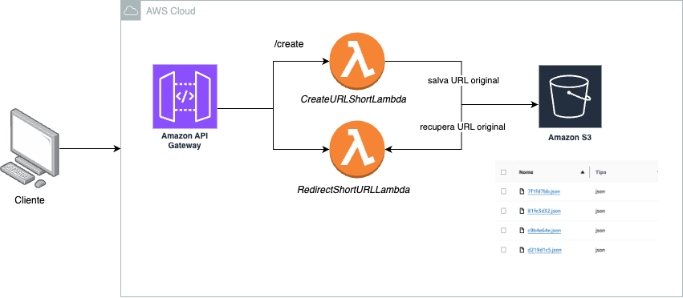
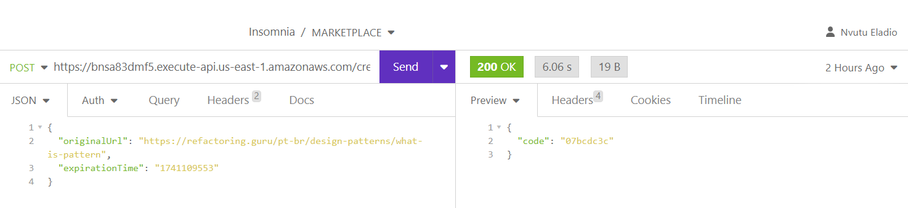

# Encurtador de URL

O projeto trata-se de um sistema de encurtamento de URLs utilizando a AWS como infraestrutura serverless. O objetivo é permitir que os usuários criem URLs curtas que redirecionem para URLs originais, com um tempo de expiração configurável. O sistema é composto por duas funções Lambda: a primeira função é responsável por gerar e armazenar os links encurtados em um bucket S3, junto com informações como a URL original e o tempo de expiração; a segunda função gerencia o redirecionamento, verificando o código da URL curta e validando se a URL ainda está dentro do prazo de expiração antes de redirecionar o usuário.


## Desenho de solução




## Documentação da API

#### Gerar e armazenar os links encurtados

```http
POST: https://bnsa83dmf5.execute-api.us-east-1.amazonaws.com/create
```




#### Acessando o site original com o link encurtado
### Att: Esse endpoint precisa ser chamado a partir de um browser
```http
  GET: https://bnsa83dmf5.execute-api.us-east-1.amazonaws.com/07bcdc3c
```
